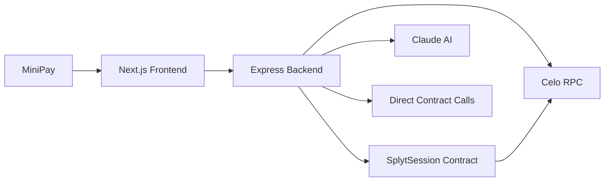

# Architecture

## Overview
Splyt is a MiniPay-first application where receipt parsing, payment orchestration, and session settlement are coordinated by a backend service while final payment truth lives on-chain in `SplytSession`.

## System Diagram (Mermaid flowchart LR)

## Payment Flow
1. Host uploads receipt in MiniPay app.
2. Frontend calls `POST /api/parse` for free receipt parsing.
3. Backend parses with Claude and returns structured receipt JSON.
4. Host confirms members/amounts and creates session with `POST /api/session`.
5. Backend writes session to chain via `createSession`.
6. Members open payment links and hit `GET /api/pay/:sessionId/:memberAddress`.
7. Backend marks member paid on-chain via direct contract call and streams updates to host via SSE.
## Direct Payment Flow

1. Client calls payment endpoints directly.
2. Backend returns the amount due for a member.
3. Frontend submits the on-chain payment transaction.
4. Backend verifies settlement against the contract.
5. Host receives status updates over SSE.

## Data Flow
- `ParsedReceipt`: normalized receipt totals and line items.
- `SplitSession`: session metadata + member obligations.
- `PaymentRequest`: Direct contract call with member amount.

- `PaymentReceipt`: Transaction hash and on-chain confirmation.
## Security Considerations
- Private key management: host key only in backend env/secret manager.
- On-chain replay protection: contract state prevents double-payments.
- Session expiry enforcement: contract rejects payment updates after expiry.
- Rate limiting on parse endpoint: protect expensive AI calls from abuse.
