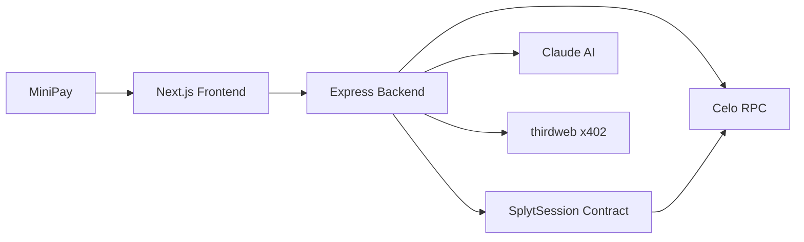

# Architecture

## Overview
Splyt is a MiniPay-first application where receipt parsing, payment orchestration, and session settlement are coordinated by a backend service while final payment truth lives on-chain in `SplytSession`.

## System Diagram (Mermaid flowchart LR)

## Payment Flow
1. Host uploads receipt in MiniPay app.
2. Frontend pays x402 parse fee and calls `POST /api/parse`.
3. Backend parses with Claude and returns structured receipt JSON.
4. Host confirms members/amounts and creates session with `POST /api/session`.
5. Backend writes session to chain via `createSession`.
6. Members open payment links and hit `GET /api/pay/:sessionId/:memberAddress`.
7. Backend verifies x402 payment, marks member paid on-chain, and streams updates to host via SSE.

## x402 Protocol Flow
1. Client requests x402-gated endpoint.
2. Server returns `402` plus challenge headers.
3. Client signs/submits payment proof.
4. Client retries request with `x-x402-proof` header.
5. Server settles and processes request.

## Data Flow
- `ParsedReceipt`: normalized receipt totals and line items.
- `SplitSession`: session metadata + member obligations.
- `PaymentRequest`: x402 challenge data and expected amount.
- `PaymentReceipt`: x402 receipt id and amount metadata.

## Security Considerations
- Private key management: host key only in backend env/secret manager.
- x402 payment replay protection: single-use receipt validation in settlement layer.
- Session expiry enforcement: contract rejects payment updates after expiry.
- Rate limiting on parse endpoint: protect expensive AI calls from abuse.
