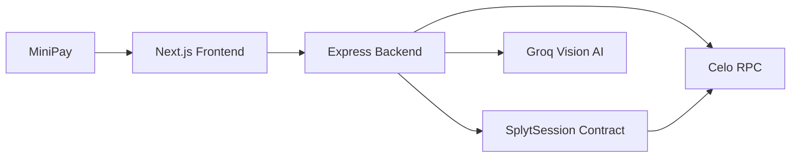
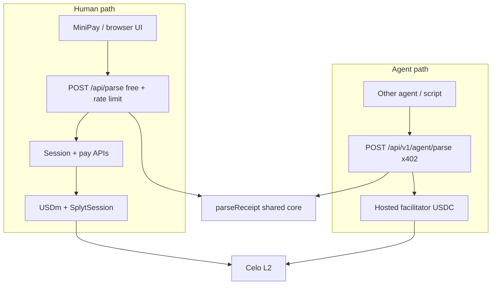

# Architecture

## Overview

Splyt is a MiniPay-first application where receipt parsing, payment orchestration, and session settlement are coordinated by a backend service while final payment truth lives on-chain in `SplytSession`.

Splyt also exposes a **machine / agent path**: other agents pay for AI parse via **x402 (USDC)** without using the human USDm bill-settlement flow. Design lock: [`agent.md`](./agent.md), plan: [`implementation.md`](./implementation.md).

## System Diagram (human UI)

```mermaid
flowchart LR
  A[MiniPay] --> B[Next.js Frontend]
  B --> C[Express Backend]
  C --> D[SplytSession Contract]
  C --> E[Groq Vision AI]
  C --> G[Celo RPC]
  D --> G
```

## Dual-path diagram (human vs agent)

```mermaid
flowchart TB
  subgraph humans [Human path]
    UI[MiniPay / browser UI]
    ParseFree["POST /api/parse free + rate limit"]
    Session[Session + pay APIs]
    USDm[USDm + SplytSession]
    UI --> ParseFree --> Session --> USDm
  end

  subgraph agents [Agent path]
    Agent[Other agent / script]
    ParsePaid["POST /api/v1/agent/parse x402"]
    X402[Hosted facilitator USDC]
    Agent --> ParsePaid --> X402
  end

  ParseFree --> AI[parseReceipt shared core]
  ParsePaid --> AI
  USDm --> Celo[Celo L2]
  X402 --> Celo
```

| Path | Parse | Settlement | Token |
|------|-------|------------|--------|
| Human UI | `POST /api/parse` (free) | User-signed contract txs | **USDm** |
| Agent API | `POST /api/v1/agent/parse` (x402) | Facilitator EIP-3009 settle | **USDC** |

**Do not** put x402 on the default MiniPay parse route. Hosted x402 does not support USDm.

## Payment Flow (human)

1. Host uploads receipt in MiniPay app.
2. Frontend calls `POST /api/parse` for free receipt parsing.
3. Backend parses with Groq vision and returns structured receipt JSON.
4. Host confirms members/amounts and creates session with `POST /api/session`.
5. Host (or flow) writes session on-chain via `createSession`.
6. Members open payment links and settle their share in USDm via `SplytSession`.
7. Host receives status updates over SSE (`GET /api/status/:session`).

## Agent payment flow (planned — Phase C)

1. Agent calls `POST /api/v1/agent/parse` without payment → **402** + requirements.
2. Agent signs USDC EIP-3009 authorization and retries with payment header.
3. Facilitator (`api.x402.celo.org` / Sepolia) verifies and settles; gas sponsored.
4. Backend runs the same `parseReceipt` core and returns structured JSON.
5. USDC moves buyer → `SELLER_PAY_TO` (never custodied by Splyt or the facilitator).

## Direct Payment Flow

1. Client calls payment endpoints directly.
2. Backend returns the amount due for a member.
3. Frontend submits the on-chain payment transaction.
4. Backend verifies settlement against the contract.
5. Host receives status updates over SSE.

## Data Flow

- `ParsedReceipt`: normalized receipt totals and line items.
- `SplitSession`: session metadata + member obligations.
- `PaymentRequest`: Direct contract call with member amount.
- `PaymentReceipt`: Transaction hash and on-chain confirmation.

## Security Considerations

- Private key management: users sign contract writes from their own wallets; backend stores session metadata and verifies chain state.
- On-chain replay protection: contract state prevents double-payments.
- Session expiry enforcement: contract rejects payment updates after expiry.
- Rate limiting on free parse endpoint: protect expensive AI calls from abuse.
- Agent path (future): `X402_API_KEY` and operator keys stay server-side only; never `NEXT_PUBLIC_*`.
- Agent path does not replace USDm settlement; it only meters API access.
